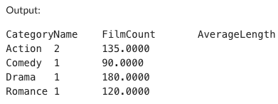

# Week 6: Complex SQL Query for a MySQL Databas[](https://github.com/nogibjj/ids706-week6-sql/actions/workflows/ci.yml)

## Project Description

This project involves creating a complex SQL query to analyze data from a movie database. The query computes the count and average length of movies in each category.

## Requirements

1. Design a complex SQL query involving joins, aggregation, and sorting.
2. Provide an explanation for what the query is doing and the expected results.

## Grading Criteria

- Query functionality (20 points)
- Explanation and documentation (20 points)

## Deliverables

- SQL query
- Written or video explanation of the query

## Setup Instructions

### Database Setup

1. Create the `categories` and `movies` tables using the provided SQL script.
2. Populate the tables with the provided data.

```sql
CREATE TABLE categories (
  category_id INTEGER PRIMARY KEY,
  category_name TEXT NOT NULL
);

INSERT INTO categories VALUES (1, 'Action');
INSERT INTO categories VALUES (2, 'Comedy');
INSERT INTO categories VALUES (3, 'Drama');
INSERT INTO categories VALUES (4, 'Romance');

CREATE TABLE movies (
  movie_id INTEGER PRIMARY KEY,
  movie_name TEXT NOT NULL,
  category_id INTEGER NOT NULL,
  length INTEGER NOT NULL,
  FOREIGN KEY (category_id) REFERENCES categories(category_id)
);

INSERT INTO movies VALUES (1, 'Movie A', 1, 120);
INSERT INTO movies VALUES (2, 'Movie B', 1, 150);
INSERT INTO movies VALUES (3, 'Movie C', 2, 90);
INSERT INTO movies VALUES (4, 'Movie D', 3, 180);
INSERT INTO movies VALUES (5, 'Movie E', 4, 120);
```

### Query Execution

1. Execute the provided SQL query using a MySQL database management tool such as MySQL Workbench or command line.
2. Review the results to ensure they meet the project requirements.

## SQL Query

```sql
WITH CategoryFilmCount AS (
    SELECT
        categories.category_name AS CategoryName,
        COUNT(movies.movie_id) AS FilmCount
    FROM
        categories
    JOIN
        movies
    ON
        categories.category_id = movies.category_id
    GROUP BY
        categories.category_name
),
CategoryAverageLength AS (
    SELECT
        categories.category_name AS CategoryName,
        AVG(movies.length) AS AverageLength
    FROM
        categories
    JOIN
        movies
    ON
        categories.category_id = movies.category_id
    GROUP BY
        categories.category_name
)
SELECT
    CategoryFilmCount.CategoryName,
    CategoryFilmCount.FilmCount,
    CategoryAverageLength.AverageLength
FROM
    CategoryFilmCount
JOIN
    CategoryAverageLength
ON
    CategoryFilmCount.CategoryName = CategoryAverageLength.CategoryName
ORDER BY
    CategoryFilmCount.FilmCount DESC;
```

## Query Explanation

The query defines two Common Table Expressions (CTEs) to compute the count and average length of movies in each category. It then joins these CTEs and orders the results by the count of movies in descending order. The result set includes the category name, count of movies, and average length of movies in each category.

## Expected Results

The result set will have three columns: `CategoryName`, `FilmCount`, and `AverageLength`. Each row represents a movie category, the count of movies in that category, and the average length of movies in that category. The rows are ordered by `FilmCount` in descending order.

